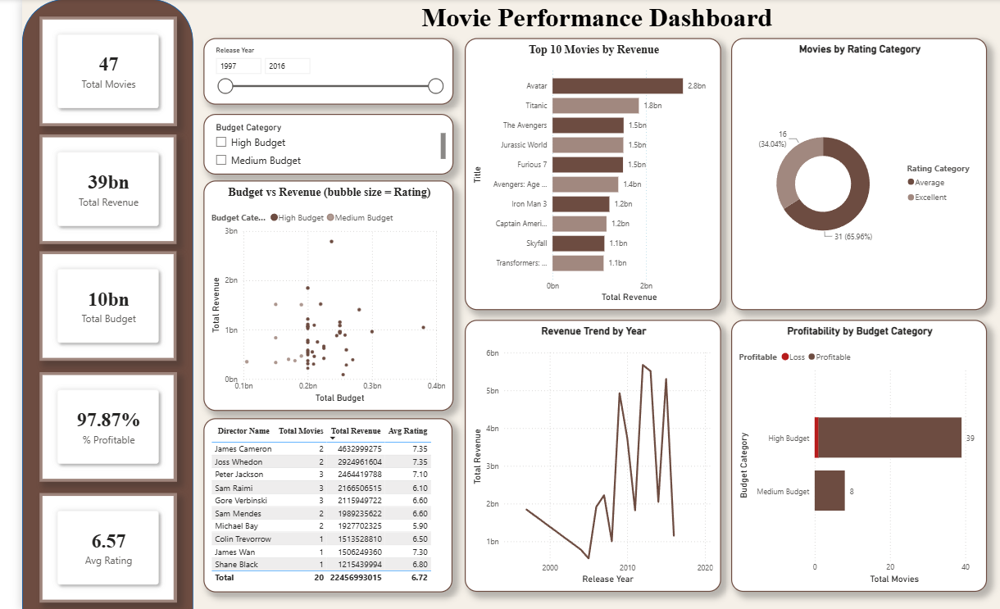

# 🎬 IMDB Movies Database — SQL & Power BI Capstone Project

An end-to-end data analytics project: connecting to a remote **MySQL** database, joining and querying two relational tables, exporting a clean dataset, and visualising key movie-performance metrics in an interactive **Power BI** dashboard.

---

## 📌 Project Overview

This project analyses a movie dataset sourced from IMDB, stored in a MySQL database (`project_movie_database`) containing two related tables — **Movies** and **Directors**. The goal was to:

1. Connect to the remote database
2. Correctly join the two tables
3. Answer 13 business questions using SQL
4. Export a clean, analysis-ready dataset
5. Visualise key metrics in an interactive Power BI dashboard

---

## 🛠️ Tools & Technologies

| Tool | Purpose |
|---|---|
| **MySQL Workbench** | Connecting to the remote database and writing/running SQL queries |
| **MySQL** | Hosting the `project_movie_database` schema |
| **Microsoft Excel** | Staging area for the exported, query-ready dataset |
| **Power BI Desktop** | Building the interactive dashboard |
| **Word / PowerPoint** | Final report and presentation deliverables |

---

## 🗂️ Repository Contents

| File | Description |
|---|---|
| `IMDB_Movies_Capstone_SQL_Queries.sql` | All 13 SQL business questions + export queries |
| `IMDB_Movies_Dataset.xlsx` | Final cleaned, joined dataset used for Power BI |
| `IMDB_Movies_Capstone_Dashboard.pbix` | Power BI dashboard file |
| `dashboard_screenshot.png` | Screenshot of the Power BI dashboard |

---

## 🧩 Data Model

The **Movies** table stores one row per film (budget, revenue, popularity, vote average, release date, etc.) and holds a `director_id` foreign key. The **Directors** table stores one row per director (id, name, gender, department).

```sql
Movies.director_id = Directors.id
```

`Movies.id` is kept only as the row identifier and is never used as the join key.

---

## ❓ Business Questions Answered

1. Get all data about movies
2. Get all data about directors
3. Count total movies present
4. Find specific directors (James Cameron, Luc Besson, John Woo)
5. Find directors with names starting with 'S'
6. Count female directors
7. Find the 10th female director (by id)
8. Find the 3 most popular movies
9. Find the 3 most bankable movies
10. Find the highest-rated movie since Jan 1, 2000
11. Find movie(s) directed by Brenda Chapman
12. Find the director with the most movies
13. Find the most bankable director

Full queries and results are documented in the SQL file above — every query with its output is commented inline.

---

## 📊 Dashboard — "Movie Performance Dashboard"

The exported dataset was loaded into Power BI Desktop to build an interactive dashboard with:
- **KPI cards** — Total Movies, Total Revenue, Total Budget, % Profitable, Avg Rating
- **Slicers** — Release Year, Budget Category
- **Visuals** — Top 10 Movies by Revenue, Budget vs Revenue (bubble = rating), Movies by Rating Category, Director Summary Table, Revenue Trend by Year, Profitability by Budget Category



---

## 💡 Key Insights

- **Avatar** is both the most bankable single movie and the reason **James Cameron** is the most bankable director overall (~$4.2B combined revenue).
- **Jurassic World** is the most popular movie by audience popularity score, despite not topping the profit ranking.
- **Peter Jackson, Gore Verbinski and Sam Raimi** are tied as the most prolific directors, each with 3 films.
- The full **Directors** table is far larger than the Movies table (150 female-coded directors, 173 starting with 'S') — most have no linked film in this particular Movies extract.

---

## 📈 Business Recommendations

1. Back proven tent-pole formulas — prioritise franchise-scale, high-budget titles.
2. Invest in high-ROI directors with a strong bankability track record.
3. Balance the budget mix between high-budget bets and efficient mid-budget films.
4. Time releases around historically stronger years.
5. Close the director data gap by linking every director to a filmography.

---

## 👤 Author

**Pinky Vishwakarma**
📧 Vishwakarmapinky07@gmail.com

---

*This project was completed as part of the SQL for Data Analysis capstone (PRSQL-01).*
